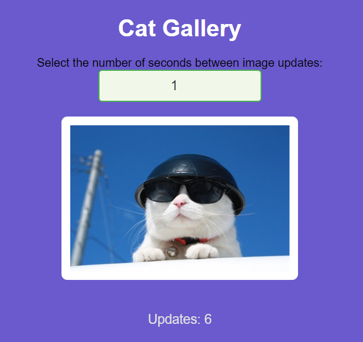

# Cat Image Fetcher


This is a simple web application that fetches random cat images from The Cat API and displays them on the page. Users can set the interval for how often a new image should be fetched.

## Features

- Fetches random cat images from The Cat API.
- Displays the total number of images fetched.
- Allows users to set a custom interval for fetching images.
- Responsive design with a user-friendly interface.

## Technologies Used

- HTML
- CSS
- JavaScript
- The Cat API

## Getting Started

To run this application locally:

1. Clone the repository:
   ```bash
   git clone 
   cd cat-image-fetcher


